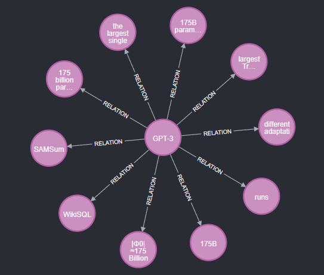

# Knowledge-based RAG

<p align="center">
  
</p>

This repository provides a framework for building a knowledge graph from text data and using it for retrieval-augmented generation (RAG) with large language models (LLMs). The process involves extracting entities and relations from text, storing them in a Neo4j database, and retrieving relevant information based on user queries.

## File Structure

```shell
.
├── databases              # Stores data extracted by LLMs
├── data_sources           # Contains source data for relation extraction (Create this folder manually)
├── imgs                   # README images
├── KG_builder             # Scripts for building the knowledge graph
├── neo4j                  # Files related to the Neo4j database (auto-generated by docker-compose)
├── retrievers             # Retrieval methods for GRAG (currently under development)
├── docker-compose.yml     # Script to set up the Neo4j environment
├── README.md              # This file
└── utils                  # Utility functions
```

## Install Requirements

```bash
pip install -r requirements.txt
```

## Set Up Neo4j Database

Make sure you have **Docker** and **Docker Compose** installed.
(*Docker Compose should be included in recent Docker versions.*)

Start the Neo4j database:

```bash
docker compose up -d
```

## Build the Knowledge Graph

### Extract Triplets using LLM

In this step, we use an LLM to extract **entities** and **relations** from text.
The extracted information is stored as triplets: `(subject, relation, object)`, along with the **index of the original text chunk**.

**We use 4-bit quantization by default to reduce GPU usage.**

#### Workflow

1. Load data from a specified directory and split it into text chunks.
2. For each chunk, extract triplets using an LLM and save them to a JSON file.
3. Output includes `clean_triplets.json` and `text_chunk.json`.

| Argument          | Description                                                                            |
| ----------------- | -------------------------------------------------------------------------------------- |
| `data_source_dir` | A folder under `data_sources` containing the source data (currently supports PDF only) |
| `database_dir`    | Name of the output folder (will be created inside `databases`)                         |
| `model_name`      | LLM model for extraction (default: `microsoft/phi-4`)                                  |
| `chunk_size`      | Size of each text chunk (default: 512)                                                 |
| `chunk_overlap`   | Overlap size between text chunks (default: 256)                                        |
| `max_tokens`      | Max number of tokens for LLM generation                                                |
| `temperature`     | Sampling temperature (default: 0.7)                                                    |
| `top_p`           | Top-p sampling parameter (default: 0.9)                                                |
| `top_k`           | Top-k sampling parameter (default: -1)                                                 |
| `device`          | Device to run inference (`cuda` or `cpu`)                                              |

```bash
CUDA_DEVICE_ORDER=PCI_BUS_ID CUDA_VISIBLE_DEVICES=1 python -m KG_builder.LLM \
  --data_source_dir test \
  --database_dir test
```


### Import Triplets into Neo4j

Use the triplets extracted in the previous step to populate the Neo4j database.

| Argument       | Description                                                                      |
| -------------- | -------------------------------------------------------------------------------- |
| `database_dir` | A folder under `databases` that contains the JSON outputs from the previous step |

```bash
python -m KG_builder.neo4j --database_dir test
```

After this command, you can access the Neo4j database at `http://localhost:7474` (remember forword the port from container to localhost) with the default credentials (you can change them in `docker-compose.yml`):
- **Username**: `neo4j`
- **Password**: `password`

## Retrieve Information from Knowledge Graph

The implementation of retrieval methods is under `retrievers`.
In `NHopRetriever`, we use a retrieval strategy based on named entity recognition from user queries:
1. Identify entities in the query.
2. Retrieve their **n-hop relations** from the graph.
3. Convert the relations and related text chunks into embeddings using an LLM.
4. Use these embeddings to find the most relevant text chunks based on dot product of embeddings.
5. Return the top-k relevant text chunks.

Example usage of `NHopRetriever`:

```python
from retrievers.NHopRetriever import NHopRetriever

retriever = NHopRetriever(embedding_model="intfloat/multilingual-e5-small", NER_model="microsoft/phi-4")
top_k_results = trtriever.retrieve(
    query="What is the LoRA?",
    n_hop=2,
    top_k=10,
    use_text_chunk=True
)
print(top_k_results)
```

## Generate Text with Knowledge Graph

Use `generate.py` to perform retrieval-augmented generation (RAG) with the retrieved text chunks.
| Argument                    | Description                                                                                |
| --------------------------- | ------------------------------------------------------------------------------------------ |
| `model_name`                | LLM model for generation (e.g., `microsoft/phi-2`)                                         |
| `prompt`                    | The prompt to generate text from the retrieved information                                 |
| `temperature`               | Sampling temperature for generation (default: `0.7`)                                       |
| `relevant_top_k`            | Number of top relevant chunks to retrieve (default: `5`)                                   |
| `top_p`                     | Top-p sampling parameter for generation (default: `0.9`)                                   |
| `top_k`                     | Top-k sampling parameter for generation (default: `None`, meaning no top-k filtering)      |
| `max_new_tokens`            | Maximum number of new tokens to generate (default: `512`)                                  |
| `retriever_ner_model`       | Path or name of the NER model used in the retriever (default: `microsoft/phi-4`)           |
| `retriever_embedding_model` | Embedding model for retrieving relevant chunks (default: `intfloat/multilingual-e5-small`) |
| `retriever_n_hop`           | Number of hops for the N-hop retriever (default: `1`)                                      |
| `retriever_used_text_chunk` | Whether to use text chunks in the retriever (default: `True`)                              |


```bash
python -m generate --model_name "microsoft/phi-4" --prompt "What is LoRA?"
```

## TODO

- Implement more retrieval methods in `retrievers`.
- Add evaluation metrics for retrieval and generation.
- Use browser-based interface for easier interaction with the knowledge-based RAG system.
- Improve error handling and logging.